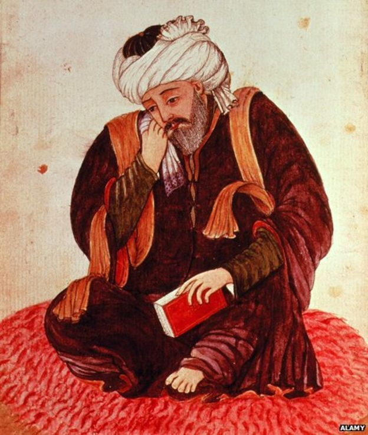

This repository is a fork of [nanoGPT](https://github.com/karpathy/nanoGPT)

It is modified (see prepare.py) to generate poetry 'similar' to Hafez.
It is trained on Hafez 500 Ghazals.

For the dependency list see the original nanoGPT project.

```
python data/hafez_char/prepare.py
```

Quick Train without GPU
```
python train.py config/train_hafez_char.py --device=cpu --compile=False --eval_iters=20 --log_interval=1 --block_size=64 --batch_size=12 --n_layer=4 --n_head=4 --n_embd=128 --max_iters=2000 --lr_decay_iters=2000 --dropout=0.0
```

```
python sample.py --out_dir=out-hafez-char --device=cpu
```

The 0.79M parameter model generates peotry such as the following, which for the given
number of parameters it is really not too bad!

```
قبی و دران مه جام پسويری کن
افعمر آن سرت آباز حواور باد


غزل    ۴۲۷

حافظ روی سنجی قامان سيا مکن زد
که صد با سر چه دماده که باشد

نه چشم که شد در در خيالت فرو
چرا سحر دوس دل می‌کشيد که عهداخت

حال می آرد تو مه چه شمار رفت
ما بر که چه شره بی از قالچه شمار

از منجل در گندار خراجان حافظ بگذر
وين که چه شمع شمان از حکار کرد


غزل    ۲۳۸

به چه نقش ای را را به روقی نامم آرود
که کار جر بهر هم بر زار باشک

ازر طف کرده کرد خدر و غيامش مداد
چه تو گل که بياد کردی پاکنه برمه‌گرم

چون ميانه به نشيد بوی بن
---------------

محت رخ سيان که گر زنک باشت دوست

در تو زلف پيش استاره دوست کرد
که چشم و کشت به قيال نگيری کن

باشده دل در ملام از چکن بر کرب
که ميک چو به سر در خاکی خخرا نمی باش

چو باغ خواطای کرد من که رعلی دوست
چو من ای شکر از کايت در به مايی روی

غزل    ۳۴۹

که اين نتا کايی عز در گل می‌کند
بهای برودی در مرکنه هر طرحاب و کر

که از با رفتند کرد از العل تو
تا شکره اين کشم دران آن خون کند

کس تاردم پادر خويث گر بيا می‌بيد
چندم نه به سبازی بهار به سر نشنير

نهاغرت نشود خوش دل کوشت بی‌بود
خن ندر نقيم شب به ما ز ما
---------------

سيحور و حافظ که به چون آخن منين کن
ما در گريش چنيزد رو حرق تو چون

خواش ز مهر مجره با ز آييان سامد که تو
اگر نتدا که جان کنبان که بر دارد

نی تو نرگ تو گر نديمن لبی که او غم دل
آن صبا خراب اندا در او او در کجان

حافظ مسته به تو تاباند پيشاام
که و طره و تا کنايم استاد کن

چه آن که چند عشود کن بر نقش می‌دم

در آن به دست مست می اين کن امران است
جام
به در خدا برده نيست و لاله تيک با خوش

دو آنج تو گل و کام ما مسپيرنه يار
حافظ اين ما خوش و را دارت افتاد

من شاهر که با افله نگل می‌رود
که دربر سمانه فر
---------------


خون به لول سحر که زر پيشان
که جان چو که ما قول عشنش قدات

ز اور می‌دان اين خرض هر کن
به و تاب در اين ببايد به در نيست


غزل    ۳۲۵۰


اور رازن که دل بيد که امن ربيام می‌دار

بمی عشقی و نرقه اين ابر بازم چون تو
در بهايای غيرت کو که مان چه عاملی ما


غزل    ۳۸۰

ماز به ز می حافظای من که از داد بوش


غزل    ۳۴۴۵

حافظ که دلوم بود و ککن درم زيانه

هر بر مدير پيران فرو خود کنن و کسمو تو
به ظر دامه تا به دهر کنم خوری نمست


غزل    عدار هر بل می‌بينم چه مجللت
وفک با بر روی که چرقيب سردناخت

سره کسن جم
```
